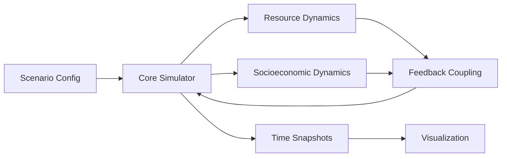

# План Реалізації: Симуляція Корусанта

## 1. Мета

Побудувати симулятор планети-міста Корусант у 3 шарах:

1. Фізично-ресурсний шар (тепловий режим, вода, енергетика).
2. Соціо-економічний шар (щільність, продуктивність, нерівність, заворушення).
3. Візуальний шар (карти стану, динаміка в часі, сценарні порівняння).

## 2. Scope MVP (4-6 тижнів)

MVP не моделює повну геофізику планети. Він моделює Корусант як 2D-решітку районів з причинно-зв'язаними полями.

Обов'язкові змінні стану району:

- population_density
- infrastructure
- energy_load
- water_stress
- temperature
- security_index
- unrest
- productivity

MVP сценарії:

1. Базовий режим.
2. Енергокриза.
3. Водний дефіцит.
4. Підсилена безпека.

## 3. Архітектура

## 4. Формалізація кроку симуляції

На кожному кроці $t$:

1. Оновлення попиту на енергію:
$$E_t = f(population, infrastructure, unrest)$$

2. Тепловий режим:
$$T_t = T_{base} + \alpha \cdot E_t - \beta \cdot cooling$$

3. Водний стрес:
$$W_t = demand_t - recycle_t + climate\_penalty_t$$

4. Соціальна напруга:
$$U_t = U_{t-1} + c_1\cdot W_t + c_2\cdot inequality - c_3\cdot security$$

5. Продуктивність:
$$P_t = P_0 \cdot infra\_factor \cdot (1-U_t)$$

## 5. KPI для валідації

- Mean temperature drift (стабільність режиму).
- Частка районів із high water stress (>0.7).
- Частка районів із high unrest (>0.6).
- Загальна продуктивність системи.
- Resilience time: кількість кроків до відновлення після шоку.

## 6. Roadmap після MVP

### Phase 1: Core City Twin

- Кластеризація районів за типами (upper city / mid levels / undercity).
- Транспортний граф між районами.
- Модуль policy interventions (вода, енергія, безпека).

### Phase 2: Multi-Agent Layer

- Домогосподарства, корпорації, фракції.
- Ринки праці/ресурсів.
- Виникнення протестів і політичних циклів.

### Phase 3: Planetary-Scale Link

- Зв'язок Корусанта з міжпланетною логістикою.
- Імпорт/експорт ресурсів.
- Зовнішні геополітичні шоки.

## 7. Технічний стек (рекомендований)

- Python + NumPy (ядро симуляції).
- Matplotlib (MVP візуалізація).
- Xarray/Zarr (збереження довгих прогонів).
- Пізніше: FastAPI + frontend dashboard.
